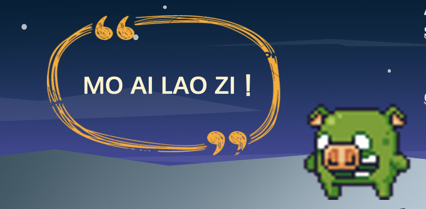

# Pitch Document

[toc]

## 1. 游戏基本信息

团队成员：1751894 杨乐 1751714 许靖宁 1751697 甘俊毅 1752792 李博阳 1652667 梁栎鹏

游戏题目：Where is my pig

游戏平台：Windows x86_64

游戏体裁：2D平台跳跃+解密游戏，共有4个普通关卡+1个boss关卡

面向群体：青少年，平台跳跃以及解密游戏爱好者

游戏体验：需要一定的操作技巧、动脑筋以及要有耐心才能过关，考验玩家的智慧与操作

代码地址：https://github.com/Easonrust/baba-is-Mario

## 2. 游戏操作

### 核心机制

解密闯关类游戏，游戏核心机制取材于著名游戏baba is you。玩家可以控制人物左右移动，一段跳，二段跳，射击字块，顶动字块。通过射击字块，顶动字块来改变字块位置，拼出不同的句子，达到改变控制对象、场景效果、甚至输赢条件的效果。

### 操作手势

1. 方向键”->"前进，“<-”后退，空格键跳跃，空中再次按空格键可进行一次二段跳
2. “Z”键射击

## 3. 游戏故事

游戏名为“Where is my pig”，汉译为“俺家猪丢了”。整个游戏故事以主人公Lele找猪为主线。故事发生在一个物理规则可被操控的奇妙世界 (a brave new world)，游戏主人公通过不断改变物理规则实现其目标。

### 故事背景

Lele 发现自己的猪丢了，沿着脚印踏上了通往奇异世界(a brave new world)的旅程。


### 第一关

Lele开始熟悉这个诡异的世界，找到了他的猪。

然而这只叛逆的猪跳上悬崖，宣称自己已经是一头成熟的猪，不再是Lele的宠物。

Lele眼见无法把猪带回家，只好去找他的好朋友——功夫青蛙Wawa求助。


### 第二关

Lele 历经千辛万苦找到了Wawa，二人相约一起去抓猪。


### 第三关

二人合作找到了猪，然而这头猪越来越来越强大，二人已经无法控制它。

Wawa只好建议去请大师Maskr出山。


### 第四关

Maskr能力强大，可有多个分身。三人相互配合，终于组成了“抓猪者联盟”（the Pig Finding Alliance)


### 第五关（boss关）

终于叛逆疯狂的猪被打败，它心服口服，跟着Lele回了家，决定做一只乖巧的宠物猪。


## 4. 游戏剧情特色

整个故事表面荒诞，实则包涵了许多创作者的用意。

首先创作者们着力讲关卡设计与故事剧情相匹配，每一关的故事文字内容都和通关诀目标及诀窍紧密相连。同时整个故事具有连续性以及适当的波折，增强了玩家的关注度。

为求整个游戏的统一度，游戏的故事文字皆撰写为英文版，对于文字内容创作者们花费了许多心思以提高其吸引力与趣味性。

如



该部分直接用拼音拼出“莫挨劳资”，传神有趣地表现猪的愤怒，与游戏剧情相呼应。


此处借用“友谊的小船说翻就翻”，也为引玩家一笑。

同时Maskr的开场白

> I am Maskr under Mask who is a marvelous master, manifesting multi-where. 
>
> With my magnificent mind and marble muscle, you may minimize the mess! 
>
> Don't miss me！

致敬了电影《V字仇杀队》中V的经典开场白。


整个故事创作者们都在不停渲染其荒诞性，更能契合当代“游戏人间”、“丧”的社会思潮。表层的荒诞之下其实具有创作者们一些深层思考。

首先是叛逆疯狂的猪这个形象，灵感来源于乔治·奥威尔的反乌托邦小说《动物庄园》，在此引用其结尾：

> 窗外的动物们先看看猪,再看看人,又反过来先看人,后看猪,但他们再也分辨不出人和猪有什么分别了。

而这个游戏的剧情恰恰和小说这一情节相符合。

更进一步，游戏里的猪从叛逃、反抗、到最后乖顺地回家，影射了“社畜”的心理变化与经历命运。故事之荒诞亦现实之荒诞，创作者们也希望借此引起一些思考。

## 5. 游戏设计

### 开始页面

UI界面采用类似游戏的方式，玩家通过设计字块进行选择。选择**go back to home**后退出游戏，选择**find his pig**后开始游戏。

### 关卡转场

每个关卡之前和之后之前有推动游戏剧情的转场页面，采用打字机的效果介绍剧情，当玩家点击按钮后进入下一场景。

### 关卡设计

#### 关卡一：Brave New World & Awaking Pig


##### 关卡主题：

Hello World 中文意思是『你好,世界』。因为《The C Programming Language》中使用它做为第一个演示程序，非常著名，所以后来的程序员在学习编程或进行设备调试时延续了这一习惯。本次课程项目对于我们来说也是全新的尝试，在游戏的第一关，我们用金色砖块拼成hello world字样并以此作为地图主题，对于字母间的空隙，使用钉子适当填充以确保玩家按照我们设计的方法过关。同时，通过合理的布局留出空白区域以便在此为用户提供一些操作的教学。第一关的教学让玩家了解本游戏的基础交互机制以及“拼字”改变规则这一核心玩法。

##### 设计元素：

1.基础的平台跳跃

2.进阶的二段跳：hello后的下落后接小跳

3.简单的字块拼接：解除钉子的致命性同时产生胜利条件

4.彩蛋：hello world

##### 过关流程：

1.通过基础的平台跳跃躲避钉子，到达world字样中的l字母上。

2.向左走落下去，并在空中小跳落在r字母上。

3.通过基础的平台跳跃到达频幕左下角。

4.使用子弹拼出pig is win同时取消钉子is kill。

5.此时可以穿过钉子到达右下角，接触到pig获得本关胜利

#### 关卡二：Kong-fu Frog


##### 关卡主题：

自此开始玩家将需要对游戏机制有更深的理解，同时本关还开始对玩家的操作手法有一些要求。本观众玩家将体验角色的切换，以及本游戏对控制单位的逻辑。玩家需要控制主角以外的单位来获得游戏的胜利，同时游戏开始时，获胜的条件也不明确，需要玩家用心思考如何利用有限的字块解锁胜利条件同时切换控制角色。

##### 设计元素：

1.简单的拼字：使钉子能被推动

2.简单的操作考验：推动钉子

3.进阶的平台跳跃：二段跳越过钉子

4.进阶的拼字：获得对wawa的控制，解锁胜利条件，解除对lele的控制

5.逻辑难点：前期推开出生点上方的钉子，控制小怪后原路返回

6.逻辑难点：拆开wawa is kill否则一获得wawa 控制权则小怪立即死亡，在控制wawa 前不能拆开lele is you，原因是无可控单位。

##### 过关流程：

1.在初始区域拼出nail is you

2.将左边的钉子推开，以便后续从其上方缺口下来。

3.推开出生点右边的钉子，再经过一些基本的平台跳跃和推钉子的操作来到地图右上方。

4.is win两个字块和lele结合，纵向拼成lele is win。

5.远程子弹解除左上方的wawa is kill

6.将多余的is you用子弹推到左边组成wawa is you。在这之前不能解除lele is you，无对象可控制将判负。

7.解除lele is you保证控制wawa 跳跃时lele不动

8.控制wawa经过左边的缝隙到达出生点，重走一边lele走过的路。

#### 关卡三：Long Ranger Never


##### 关卡主题：

本关旨在通过反复切换控制单位强化玩家对游戏机制的理解。本关的逻辑难度较大，一时间不容易想出过关方法，不过好在过关方法相对线性，胜利条件也十分明确，玩家可以通过胜利条件反推过关方法。同时以较高但不至于毫无头绪的逻辑难度让玩家体验解密的快感。

##### 设计元素：

1.简单的拼字，改变控制对象，解除钉子的致命，解除史莱姆的致命

2.进阶射击时机考验：下落空中射击

3.进阶拼字：使钉子可推

4.简单的操作考验：推动钉子

5.进阶的平台跳跃：二段跳躲避钉子

6.逻辑难点：反复切换控制对象

##### 过关流程：

1.控制wawa拼字，把you向右推一格，以切换为控制lele

2.控制lele从上方越下，在空中把push字块推出一格

3.控制lele向左射击，推动you字块，转而控制wawa

4.控制wawa站到push字块上，跳起来推动kill字块解除钉子的致死

5.控制wawa解除右上角的史莱姆的致死，同时被迫添加钉子的致死。

6.控制wawa落在下方平台，向右射击切换成控制lele

7.控制lele穿过史莱姆，将push拼成钉子is push

8.推动左边的钉子开辟道路，穿过史莱姆到达左下角过关。

#### 关卡四：Master Maskr


baba is you 游戏的拼字机制玩家眼前一亮，不过也不难发现这一游戏在设计逻辑上十分考验设计师。这一核心玩法可以衍生出很多的可能性，从最开始的简单定义语句，到简单的逻辑语句，再到后来的复杂修饰符，增加的每一个新元素都不是独立的，而是与先前的元素有机结合，进而使得关卡的可能性几何式增长。但是这也让设计师头疼，过多的可能性将产生不确定性，玩家有可能采用了设计师没有想到的拼字逻辑导致游戏逻辑混乱。原本的关卡设计思路是使用地图元素和字块位置及其逻辑来限制玩家的过关途径，但在本关中，为了展现游戏的这一特性，特意提供了两种过关方法。同时让玩家明白游戏的深层内涵，玩家在本关的大部分时间中将控制多个单位，为了最后的胜利，玩家要牺牲掉部分的单位。

##### 设计元素：

1.简单的拼字：切换角色，产生胜利条件，解除钉子致命性，令钉子提供额外跳跃机会

2.进阶的拼字：十字拼字

3.逻辑难点：牺牲一个mask去解开钉子的致死

4.进阶射击时机考验：下落空中射击

5.进阶的平台跳跃：左路

6.进阶的操作考验：利用钉子的float特性跳跃。

7.同时控制多个单位

8.逻辑难点：控制钉子获得胜利

9.彩蛋：致敬推箱子，无法同时推动两个字块

##### 过关流程：

1.玩家可以发现，自己线条同时控制mask，控制mask向右走，在落下遇到钉子前发出子弹解开钉子的致死。

2.控制下方的mask拼成钉子is float

3.利用钉子的float属性跳上上方平台

4.将五个字块拼成十字，组成两个逻辑句子，一个让你控制新的单位，另一个组成过关条件。此时分支出两种过关方法。

A：控制lele，利用钉子is float跳上上方平台。在上方拼成钉子 is you。控制钉子触碰左边的wawa获得本关胜利。

B：控制wawa跳上上方平台。拆出nail字块。使用nail字块拼成nail is you。控制钉子接触右边的lele获得胜利。

#### 关卡：最终战


##### 关卡主题：

本关的难点在于躲避boss的多种攻击方式且在规定时间内完成指定的拼字逻辑。胜利条件是否明确，但是关卡设计中也保留了一些开放式的过关方法等待玩家自己探究。

##### 设计元素：

1.boss的三种攻击方式

2.boss每回合攻击后会随机说话抛出5个字块

3.简单的拼字：每回合在指定时间内完成"pig is hurt"的拼字

4.简单的操作考验：躲避boss火球，在多个平台之间往复

5.挑战点：探索出类似于“pig is you”之类的拼字。

##### 过关流程：

1.控制lele躲避boss攻击

2.完成“pig is hurt”的拼字

3.重复1-2三次则胜利

或

1.控制lele躲避boss攻击

2.完成“pig is you”的拼字

3.控制boss走向尖刺自杀


## 6. 技术细节

#### 拼字逻辑

##### 单词划分

根据baba is you的核心思想，将所有word划分成三类：

•      is单独划分为一类


 

•      表示物体的主语名词（LeLe、WaWa、Saw等）


 

•      表示状态的词


#### 技术设计

##### 逻辑划分

表示物体的主语名词在unity中的tag以"word*"**开头（如**word*pig）


 

表示状态的词在unity中的tag以"state*"**开头（如state*pig）


 

##### 连词成句的判断

在每一个word四周建立四个碰撞体，检测周围是否有其他word相邻，每次相邻word变化时，更新对应的属性。


 


 

连词成句的判断只对单词"is"进行，以竖直方向上的连词成句判断为例，代码逻辑如下：

```c#
validJudge.upWord = collision.gameObject.tag;
 if (validJudge.upWord.IndexOf("word") != -1 && validJudge.downWord.IndexOf("state") != -1)
 {
   music.Play();
   obj = GameObject.FindGameObjectsWithTag(validJudge.upWord.Split('_')[1]);
   for (int i = 0; i<obj.Length; i++)
   {
     if(validJudge.downWord == "state_you")
     {
       GlobalVar.playerCtrlNum++;
       obj[i].GetComponent<CapsuleCollider2D>().isTrigger = false;
       if(validJudge.upWord == "word_on")
       {
         obj[i].GetComponent<Rigidbody2D>().gravityScale = 1.4f;
       }
     }
     if (validJudge.downWord == "state_push")
     {
       obj[i].GetComponent<CapsuleCollider2D>().isTrigger = false;
     }
     obj[i].GetComponent<PlayerCtrl>().ctrlState[validJudge.downWord.Split('_')[1]] = true;
   }
 }
```


总结一下就是，一旦发现拼成“word*A” is "state*B"的结构，则获取所有标签为"A"的物体，将他们的状态“B”激活。

##### 物体状态的维护

由于本游戏逻辑操控上的特殊性，所有状态可更改的物体统一使用“PlayerCtrl.cs”这个脚本对状态进行维护更新，及对用户操作进行相应。

所有状态可更改的物体，统一使用相同的哈希表对状态进行管理。每个物体在start函数开始时会创建一个如图所示的Hash Table。判断一个物体是否拥有某状态"A"，即判断哈希表中关键字为"A"的布尔量是否为true。


 

##### 物体根据不同状态响应不同操作

在update函数中，根据物体是否具备状态“you"，响应用户操作。


 

在触发器检测中，根据是否具备状态“kill”、“win”、“float”去响应不同的功能。


